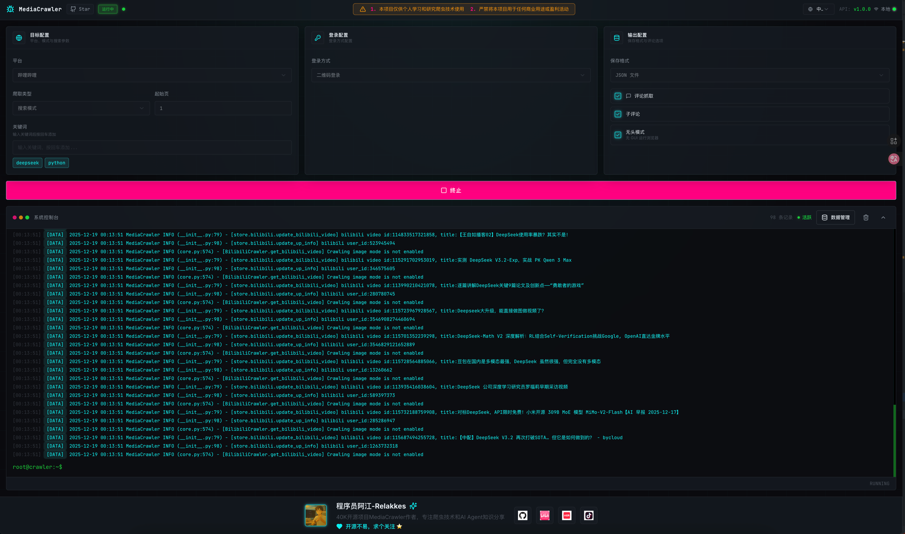

# ContentRadar

**ContentRadar 是一个多平台公开内容采集与分析工具。**

我把它定位成一个内容运营和竞品研究场景下的“数据雷达”：围绕关键词、帖子、创作者和评论，把散落在不同内容平台上的公开信息结构化采集下来，方便后续做选题分析、用户反馈整理、评论洞察、竞品内容跟踪和素材方向判断。

> 使用边界：本项目仅用于学习、研究和个人分析场景，不用于商业化采集、大规模爬取、平台干扰或任何违反平台规则的行为。使用前请阅读仓库中的 `LICENSE` 和下方免责声明。

---

## 能解决什么问题

| 场景 | ContentRadar 的作用 |
|---|---|
| 内容选题研究 | 根据关键词批量采集相关内容，观察热门话题、标题表达和互动反馈 |
| 竞品内容跟踪 | 采集指定帖子或创作者公开内容，沉淀竞品内容库 |
| 评论洞察 | 抓取一级评论和二级评论，分析用户关注点、疑虑、吐槽和购买动机 |
| 素材方向判断 | 从高频评论、爆款内容和平台反馈中提取广告素材角度 |
| 多平台对比 | 横向对比小红书、抖音、快手、B站、微博、贴吧、知乎等平台内容表现 |
| 数据沉淀 | 将采集结果保存为 CSV、JSON、JSONL、Excel、SQLite 或 MySQL |

---

## 支持平台与能力

| 平台 | 关键词搜索 | 指定帖子 ID | 二级评论 | 创作者主页 | 登录态缓存 | 代理池 | 评论词云 |
|---|---:|---:|---:|---:|---:|---:|---:|
| 小红书 | 支持 | 支持 | 支持 | 支持 | 支持 | 支持 | 支持 |
| 抖音 | 支持 | 支持 | 支持 | 支持 | 支持 | 支持 | 支持 |
| 快手 | 支持 | 支持 | 支持 | 支持 | 支持 | 支持 | 支持 |
| B 站 | 支持 | 支持 | 支持 | 支持 | 支持 | 支持 | 支持 |
| 微博 | 支持 | 支持 | 支持 | 支持 | 支持 | 支持 | 支持 |
| 贴吧 | 支持 | 支持 | 支持 | 支持 | 支持 | 支持 | 支持 |
| 知乎 | 支持 | 支持 | 支持 | 支持 | 支持 | 支持 | 支持 |

---

## 核心设计

### 1. 基于浏览器自动化保存登录态

ContentRadar 基于 Playwright 和浏览器上下文运行，可以复用登录态、Cookie 和页面环境，降低处理复杂签名逻辑的成本。

### 2. 通过统一命令切换平台

不同平台共用统一入口，通过 `--platform`、`--type`、`--lt` 等参数控制采集平台、登录方式和采集模式。

```bash
uv run main.py --platform xhs --lt qrcode --type search
uv run main.py --platform xhs --lt qrcode --type detail
uv run main.py --help
```

### 3. 提供 WebUI 可视化操作

除了命令行方式，也可以启动 WebUI，在页面中配置平台、登录方式、采集类型，并查看运行状态。

```bash
uv run uvicorn api.main:app --port 8080 --reload
```

启动后访问：

```text
http://localhost:8080
```

界面预览：



### 4. 多种数据保存方式

ContentRadar 支持把采集结果保存为：

- CSV；
- JSON；
- JSONL；
- Excel；
- SQLite；
- MySQL。

更详细的存储配置可以查看：[数据存储指南](docs/data_storage_guide.md)。

---

## 快速开始

### 1. 安装 uv

推荐使用 `uv` 管理 Python 环境：

```bash
uv --version
```

如果尚未安装，可以参考 [uv 官方安装指南](https://docs.astral.sh/uv/getting-started/installation)。

### 2. 安装 Node.js

部分平台能力依赖 Node.js，建议安装 `>= 16.0.0`。

### 3. 安装依赖

```bash
uv sync
```

### 4. 配置 Chrome CDP 模式

默认推荐使用 CDP 模式连接本地 Chrome 浏览器：

1. 安装最新版 Chrome；
2. 打开 `chrome://inspect/#remote-debugging`；
3. 勾选 `Allow remote debugging for this browser instance`；
4. 确认页面显示 `Server running at: 127.0.0.1:9222`。

如果不使用 CDP 模式，可以在 `config/base_config.py` 中设置：

```python
ENABLE_CDP_MODE = False
```

### 5. 运行采集任务

```bash
# 关键词搜索
uv run main.py --platform xhs --lt qrcode --type search

# 指定帖子详情和评论
uv run main.py --platform xhs --lt qrcode --type detail

# 查看完整参数
uv run main.py --help
```

---

## 项目结构

```text
ContentRadar
├── api/                 # WebUI API 服务
├── base/                # 爬虫基础抽象
├── config/              # 平台和数据库配置
├── database/            # 数据库模型与连接
├── media_platform/      # 各平台采集实现
├── model/               # 平台数据模型
├── proxy/               # 代理池能力
├── store/               # 数据存储实现
├── tools/               # 通用工具
├── docs/                # 使用文档
└── main.py              # 命令行入口
```

---

## 使用边界与免责声明

1. 本项目仅用于学习、研究和个人分析用途。
2. 不应用于商业化采集、大规模爬取、绕过平台限制、干扰平台服务或侵犯第三方权益。
3. 使用者应自行确认目标平台规则、账号风险、数据合规要求和本地法律法规。
4. 本项目不对因使用产生的账号限制、数据损失、法律风险或其他后果承担责任。
5. 仓库中的 `LICENSE` 明确限制为非商业学习用途，并要求保留版权声明和许可证声明。

---

## 授权与灵感来源

本项目在产品方向和代码实现上受到 [NanmiCoder/MediaCrawler](https://github.com/NanmiCoder/MediaCrawler) 启发，并在遵守原项目许可证要求的前提下进行独立包装与维护。原项目许可证声明保留在 [LICENSE](LICENSE) 中。
